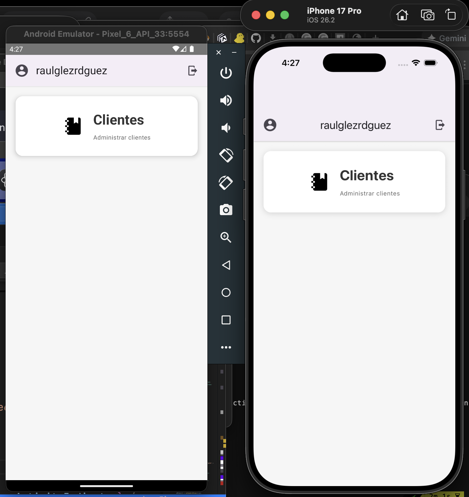
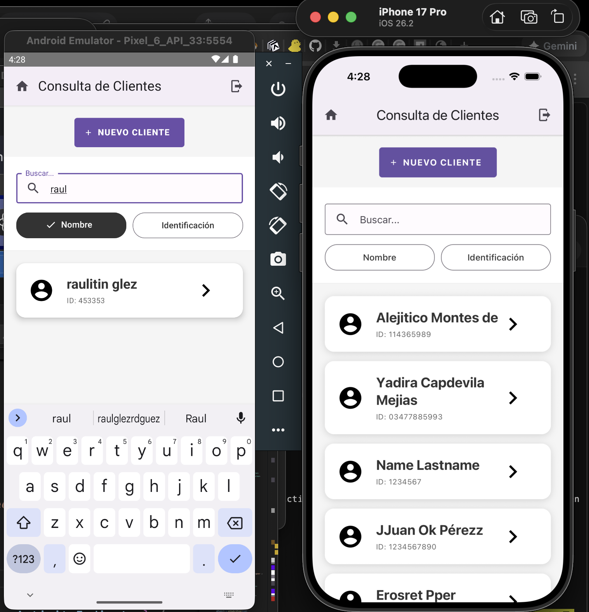
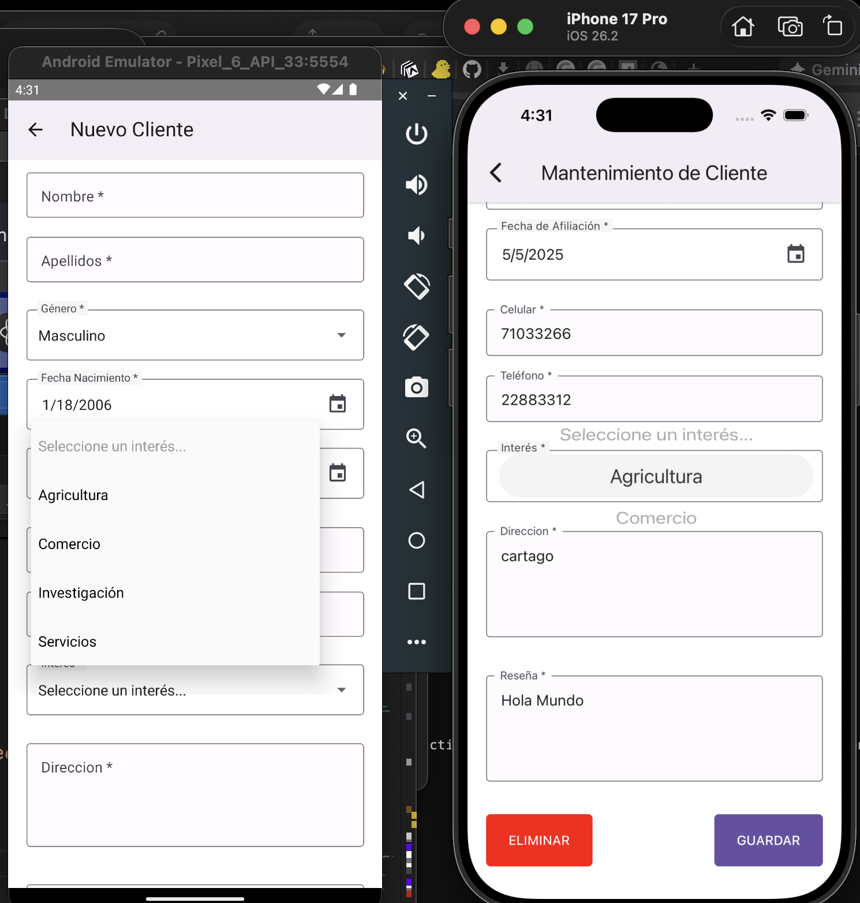

# RNISClient: react native innovasoft client

Aplicación móvil desarrollada con React Native que ofrece una experiencia de usuario completa con navegación, gestión de estado global, formularios validados y componentes de UI modernos.

## 🚀 Tecnologías Principales

- **React Native 0.83.1** - Framework principal
- **React 19.2.0** - Biblioteca de UI
- **TypeScript** - Tipado estático (recomendado)
- **Redux Toolkit** - Gestión de estado global
- **React Navigation** - Navegación entre pantallas
- **React Hook Form + Zod** - Formularios y validación
- **React Native Paper** - Componentes Material Design
- **Axios** - Cliente HTTP

## 📋 Requisitos Previos

Antes de comenzar, asegúrate de tener instalado:

- **Node.js** (versión 18 o superior)
- **npm** (versión 9 o superior) o **yarn** (versión 1.22 o superior)
- **Java Development Kit (JDK)** 17 (para Android)
- **Android Studio** con Android SDK (para desarrollo Android)
- **Xcode** (para desarrollo iOS - solo macOS)
- **Cocoapods** (para iOS)

## 📦 Instalación

1. Clona el repositorio:

```bash
git clone https://github.com/raulglezrdguez/RNISClient.git
cd RNISClient
```

2. Instala las dependencias:

```bash
# Usando npm
npm install

# O usando yarn
yarn install
```

3. Instala las dependencias de iOS (solo para macOS):

```bash
cd ios && pod install && cd ..
```

## 🎮 Scripts Disponibles

```bash
# Iniciar servidor Metro
npm start

# Ejecutar en Android
npm run android

# Ejecutar en iOS
npm run ios

# Ejecutar tests
npm test

```

## 🔍 Características Principales

### ✅ Formularios y Validación

- Uso de React Hook Form para performance optimizada
- Zod para validación de esquemas type-safe
- Integración con componentes de React Native Paper

### 🗺️ Navegación

- Stack Navigator para flujo de pantallas
- Type safety con TypeScript
- Transiciones personalizadas con Reanimated

### 🎨 UI/UX

- React Native Paper para componentes Material Design
- Vector Icons para iconografía completa
- SVG Transformer para imágenes vectoriales
- Manejo de Safe Areas en dispositivos modernos

### 💾 Estado y Almacenamiento

- Redux Toolkit para estado global
- MMKV para almacenamiento persistente y rápido
- Persistencia automática del store

### 📸 Multimedia

- Image Picker para selección de imágenes de galería/cámara
- Soporte para SVGs como componentes

### 🌐 API

- Axios con interceptores para autenticación
- Configuración base para manejo de errores
- Refresh token automático

## 🤝 Contribución

- Haz fork del proyecto
- Crea una rama para tu feature (git checkout -b feature/AmazingFeature)
- Commit tus cambios (git commit -m 'Add some AmazingFeature')
- Push a la rama (git push origin feature/AmazingFeature)
- Abre un Pull Request

## 📄 Licencia

Este proyecto está licenciado bajo la [Licencia MIT](https://opensource.org/licenses/MIT) - ver el archivo LICENSE para más detalles.

## 📞 Soporte

Email: raulglezrdguez69@gmail.com

Desarrollado con ❤️ usando tecnologias modernas de React Native CLI

## Capturas de pantalla

### Login


### Home



### Lista de clientes



### Editar cliente


